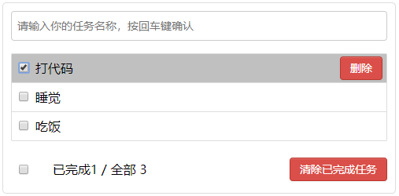

# 一个基于vue.js 的 todo list demo

> A Vue.js project

---

## 基于vue.js / vue-cli / webpack 的 todo list项目，实现了添加todo、删除todo、一键完成、一键清除、统计数目、localStorage本地存储的功能

---



## Build Setup

``` bash
# install dependencies
npm install

# serve with hot reload at localhost:8080
npm run dev

# build for production with minification
npm run build

# build for production and view the bundle analyzer report
npm run build --report
```

For a detailed explanation on how things work, check out the [guide](http://vuejs-templates.github.io/webpack/) and [docs for vue-loader](http://vuejs.github.io/vue-loader).
